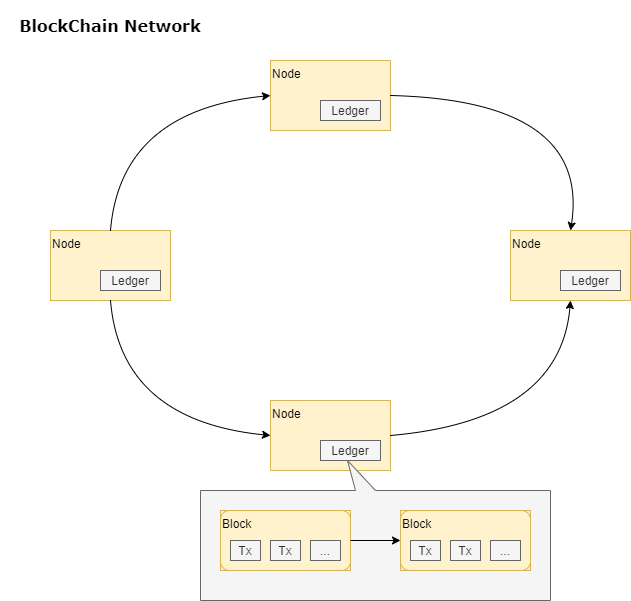
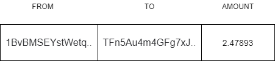

# What is Blockchain?

We probably start hearing about Blockchain almost a decade ago when someone under the pseudonym of Satoshi Nakamoto released the first Bitcoin reference implementation. If you ever wonder who Satoshi is, you are not alone, and I am pretty confident it's a secret nobody will reveal in the years to come.
Bitcoin not only introduced a digital currency as we know it today but also one of the most important inventions in the last decade, the Blockchain technology.
But what is Blockchain exactly? We will try to give a definition leaving all the fuzzwords behind. A Blockchain represents a distributed ledger of transactions running in a peer-to-peer network, where those transactions, once confirmed, can not be deleted or modified.   



The image above gives a visual representation of the Blockchain so you can grasp the concept. We can see it as transactions grouped in blocks, which are chained together. The chain is a logical pointer from one block to the previous one.

As it would happen with any peer-to-peer network you might use in the past for sharing files; the same concepts apply to Blockchain. It does not have any central authority or server, and all the participants in the network replicate the ledger of transactions. The participants who join the network for submitting transactions or reading data from the ledger are known as Nodes.
Last but not least important, most Blockchains are public, making the information on them available on-demand for everyone and representing a single source of truth. 

## Transactions and Blocks

Transactions and blocks are the first citizens of any Blockchain. We can see transactions as atomic operations that modify the state of the ledger. Any user or application is free to join the network and submit transactions, which are later broadcast to other nodes for validation and execution. Those transactions can be executed in different manners depending on the Blockchain they run. For example, Bitcoin primarily allows transactions to transfer funds between accounts. It supports scripting, but it is limited. Ethereum, on the other hand, and as we will see later in this article, enable transferring funds and running programs.

The sample below shows how a transaction might look like,



We can not discuss Blockchain without mentioning one of the common denominators for all the implementations, Public Key Cryptography (PKI). 
A pair of private and public keys gives us the ability to send and receive transactions in a Blockchain network.
We use private keys to sign transactions before submitting them to the Blockchain. On the other hand, we can derive public keys from a private key and share them with other users or applications to receive transactions. 
As public keys represent a chunk of bytes, it becomes difficult for us to share them. For that reason, every Blockchain uses different encoding techniques and algorithms to convert them first in a user-friendly string. That encoded string is what we will know as "Address" from now on.

Another important aspect related to the private/public keys is that changing the state of the Blockchain implies a cost, which anyone sending transactions must pay somehow. Every Blockchain uses native currency or tokens to express how funds are rendered (for instance, we will see Ether in Ethereum, Bitcoin in Bitcoin, or ADA in Cardano). We can not simply send arbitrary transactions to a Blockchain; we also need to have tokens associated with our private key for paying that cost.

Now it is time to ask yourself the following question; how can I get tokens in the first place to start operating in a Blockchain?  

Like any country in the world that uses a Treasury Department for printing fiat currency, Blockchain relies on particular nodes, the Miners, for token emission. Miners run a decentralized strategy known as "Mining," which consists of validating transactions, grouping them in blocks, and add those to the ledger. It's expensive in terms of energy consumption. For that reason, Miners get paid by collecting fees and rewards (issued by the network in small coin fractions) after they successfully add blocks to the ledger. 
However, before doing anything, Miners must ensure they will get that pay.  That's where a particular transaction called "Coinbase" enters the scene. A "Coinbase" is no other thing than a check, pointing to a Miner's public address.  If a miner could speak, it would say, "I did my job already, so pay me here." It is the first transaction added to any block by a Miner. 

> The chicken and egg dilemma. If a Miner wants to get pay for committing blocks into the ledger, how do they get paid when a Blockchain network starts running and no tokens are available ?.  The secret is on the rewards or tokens issued by the network. The first blocks committed to any Blockchain only have Basecoin transactions, which pay Miners with rewards. Miners later transfer those funds to other users, making tokens start flowing through the network.  

What I said before about tokens being associated with a private key is technically correct, but not how it works in real life. Tokens never leave the Blockchain. Instead, they are associated with a pointer to public addresses. Since those public addresses can only be derived from your private key, that is how you prove the tokens belong to you. The same thing happens when you want to pay for a transaction or transfer tokens. The private key that you use for signing the transaction is also used to derive the public keys where the tokens are. 

## Consensus protocols

Adding blocks to the ledger requires coordination between all the Miners in the network. To make it worse, remember that Miners also compete with each other for fees and rewards. If any Miner could add blocks at discretion, the value of the Blockchain would be 0. 
In real life, any Blockchain runs a distributed protocol, known as Consensus protocol, that governs Miners and determines how and when they can push blocks in the ledger.
Bitcoin introduced a variant of the protocol called "Proof of Work", but there are many others. Ethereum, for instance, was launched with the exact implementation and later switched to a different one called "Proof of Stake". 
We will discuss these two variants more in detail in the following sections.

### Proof of Work

Proof of work relies on computer processing to resolve complex mathematical problems. When a Miner generates a block with transactions, it also includes a hash computed from the binary representation of the transactions, a random nonce value (a set of bytes), and the previous block's hash. That makes the Blockchain resistant to changes. If a Miner wants to change a transaction in one block, it must also regenerate the hash in all the previous blocks, making this practically impossible.   
The hash for the block must follow a particular pattern to be added by the Miner into the ledger. That is where the mathematical problem enters the scene. The Miner must vary the Nonce and recalculate the hash multiple times until it gets one that matches the pattern.  The first Miner that accomplishes this task is allowed to submit the block to the ledger. Other miners validate the block's hash and make sure it is correct. Once the block is validated, the Miner gets paid. 

### Proof of Stake

The major problem with the Proof of Work protocol is energy consumption, which led many working groups in Blockchain to start looking into less expensive alternatives. That is how "Proof of Stake" came into the picture. 
As a starter, this protocol introduces an entry barrier for miners. They must put a certain number of tokens at stake to become miners or validators, as they are called in this protocol. 
In Ethereum, this number represents a minimum of 32 tokens, which is a considerable number and not something anyone can have. Those who don't meet that requirement can still share tokens with stake pools created for that purpose. The stake pool ends up running the Miner or Validator.
In terms of implementation, this protocol lets validators push blocks in the ledger based on a ranking determined by the number of tokens at stake and reputation over time. That ranking can be affected by bad decisions or when a node fails to validate transactions (e.g., it goes offline), making the validator lose tokens at stake.    

## Wallets

A wallet is another term we will often see in Blockchain. It's an application that allows end-users to create and persist private keys and derive public keys or addresses from them. 
It is not equivalent to a real-world wallet as it does not store funds (cash or credit cards) but only the private key that acts as a pointer to your tokens in the Blockchain. If the private key is lost or compromised, the same thing will happen with the tokens; you will not be able to claim any. 
You can find two types of wallets, determinist and non-deterministic. The main difference is that determinist wallets allow you to recover a private key from a seed. That seed is no other thing than a pass-phrase or a set of words that you write down and keep safe in an offline medium like a piece of paper. If the private key is lost, you can still recover it from the seed. That will not happen with a non-deterministic wallet. If you lost the private key, there is no way you could recover it.
 
You have to consider other two factors when selecting a wallet; the platform where it runs and how it stores/protects the private keys. It could web wallets, mobile wallets, or even hardware wallets.

> Wallets that don't give you direct access to your keys are known as "custodial wallets".  Exchanges for buying crypto are an example of this. There is often a phrase associated with this type of wallet, "it not your keys, not your coins."

# Ethereum

Ethereum is a Blockchain conceived by Vitalik Butarin, Martin Wood, and other members in 2013 and released in 2015. They wanted to address different limitations present in Bitcoin and especially allow the execution of short programs in the Blockchain. While Bitcoin was focused on decentralized payments, Vitalik and the rest of the team were looking for better ways to build decentralized finance systems with apps running in the Blockchain. 
They released an initial proposal that allowed users or applications to push arbitrary code in the Blockchain using transactions. That was the first time the concept of Smart Contracts (or contracts in short) was mentioned. 

## Smart Contracts
A Smart Contract is a short program that can be deployed and run on a Blockchain. It reacts to transactions sent to it by executing code, and it can also hold state and funds/tokens (Ether) on the ledger. 
In other words, you can see it as a state machine running in the Blockchain with a public address where you can push or pull the state. Those transactions can pass both funds and data. 

From an implementation standpoint, Vitalik and the rest of the crew designed a Virtual Machine for running byte code in the Blockchain, also known as Ethereum Virtual Machine or EVM. Every node in the network runs this VM, and it is ready to execute any arbitrary code. 

Creating a new contract in the Blockchain implies sending the program representation in byte code as part of the transaction data payload. Once the EV runs the transaction and the block is added to the ledger, you will get the public address where it was published. From there, you can start interacting with the contract at that address.

We also need to discuss three important aspects of Smart Contracts.

1. Execution Context
2. Gas
3. Immutability

### Execution Context

Smart Contracts run in an isolated fashion. They can only see data available on the Blockchain or call other Smart Contracts; they can not make calls to any service or query data from the outside.  

> If you got the chance of watching "The Matrix" movie, you might remember the "Oracle." It's the lady that knows everything and tells Neo about the world outside of the Matrix. You will find contracts in Ethereum that act as Oracles. External users or applications fed these contracts with external data so others can consume it.  

### Gas

Running code in the EMV comes with a price; computing resources and storage are scarce and do not come for free. The cost for using those services is expressed in a unit known as Gas, which represents short fractions of Ether (WEI or 10x18). Every transaction that you submit must pay Gas.  
That Gas is consumed by executing lines of code or allocating storage space.  If a transaction runs out of it, it is canceled, and the tokens/funds are spent anyways.
It is worth mentioning that Gas represents a unit and not a price. You assign the price when the transaction is created. The higher the price, the higher priority the transaction will have in the execution queue. Validators will want to execute the ones that pay more.
In addition, you can set a Gas limit on the transaction, which expresses how much you are willing to spend on the execution. If the transaction costs more than that, it is canceled. Otherwise, the remaining funds are returned to you.

### Inmutability

Smart Contracts are immutable. Their definition (byte code) can not be changed or updated once you were deployed on the BlockChain.  If you want to change an existing Smart Contract, you will have to deploy a new version in a new address. For that reason, you must pay special attention to code quality and testing to make sure a Smart Contract contains bugs you will never be able to fix.

## Decentralized Applications (a.k.a DApps)
If you consider Smart Contracts as back-end APIs running in the Blockchain, Decentralized Applications are the front-end or UX. 
They represent the visible layer connecting users or other applications with the Smart Contracts running in the Blockchain.  

Every Ethereum node connected to the Blockchain exposes an RPC-JSON interface over HTTPS or Web Sockets that any Dapp can use to connect and submit transactions.

The only requirement is to have a client library in your language of preference that knows how to talk to that interface.

As part of this article, we will see one of the most common implementations for Javascript, Web3.js.

> Running a node is not a requirement for implementing DApps. You can find private offerings in the cloud that gives you access to existing Nodes. For instance, [Infura] (https://infura.io/) provides free access for the first three DApps.

## Anatomy of a Smart Contract for Ethereum

A Smart Contract is deployed as byte code, but that does not imply you will have to write it that way.  You will find various high-level languages in the community that compiles and converts your code to the EVM byte code. The most popular one is Solidity.

Solidity is an object-oriented and static language influenced by C++ or javascript. If you are a web developer with experience in any bracket language like javascript, the transition to Solidity will be easier for you.

The following sample shows a Smart Contract implemented with Solidity.

```
pragma solidity >=0.8.4;
 
contract MyCoin {
	mapping (address => uint) balances;
	 
	event Transfer(address indexed _from, address indexed _to, uint256 _value);
	 
	constructor()  {
		balances[tx.origin] = 10000;
	}
	 
	function sendCoin(address receiver, uint amount) public returns(bool 		success) {
		if (balances[msg.sender] < amount) return false;
	 	
		balances[msg.sender] -= amount;
	 	balances[receiver] += amount;
	 	
		emit Transfer(msg.sender, receiver, amount);
	 	
		return true;
	}
	 
	function getBalance(address addr) public view returns(uint) {
		return balances[addr];
	}
}
```
When you see a definition of a Smart Contract written in Solidity, the first impression is that it looks like any regular class written in javascript. This sample represents an imaginary token or coin that can be transferred between addresses in the Blockchain, but let's see each part more in detail.

```
pragma solidity >=0.8.4;
```
The pragma instruction defines which version of Solidity can be used to compile the contract. If you try to compile the contract with any version not in that range, you will get a compilation error.

```
contract MyCoin {
```
MyCoin is the friendly name for the contract definition. It is only used to reference this contract in code by other contracts. 
Remember that contracts are invoked by knowing the public address, so it is impossible to have a collision by name.

```
mapping (address => uint) balances;
```
Mapping is a particular construct in Solidity that acts as a Dictionary or Hash for key/value pairs. The main difference with a regular Hash is that you can not enumerate keys or values. 
Address and Uint are specific data types that represent a public address and an unsigned integer, respectively. 
*Balances* is a private variable (stored in storage) that maintains the balance in tokens for a given address.

```
event Transfer(address indexed _from, address indexed _to, uint256 _value);
```

Transfer is an event emitted by the contract whose payload contains two addresses (from/to) and a value. Since contracts run asynchronously once a Validator mine them, they don't return any response. A way to emulate responses is to emit events. 
Those are recorded in a transaction log that any Node connected in the network can query. 
Also, client libraries usually provide a way to attach to those events. 

```
constructor()  {
		balances[tx.origin] = 10000;
}
```
The contract constructor is invoked just once when it is initially deployed in the Blockchain, and a public address is assigned. 
It assigns an arbitrary number of tokens to the address that originated the deployment (or, in other words, to the contract owner). 
"tx" is an implicit variable that gives access to information about the current transaction in context.

```
function sendCoin(address receiver, uint amount) public returns(bool 		success) {
		if (balances[msg.sender] < amount) return false;
	 	
		balances[msg.sender] -= amount;
	 	balances[receiver] += amount;
	 	
		emit Transfer(msg.sender, receiver, amount);
	 	
		return true;
}
```

This method moves tokens from one address (the owner) to another address (the receiver address). As it would happen with "tx", "msg" is another variable that provides access to the execution context. This implementation uses the msg variable to infer the sender of the transaction. It checks if the sender has available tokens in the balance and then moves it to the receiver address. If no balance is available, it returns false, and the transaction gets completed.
Finally, it emits the "Transfer" event and returns true to finalize the transaction.

```
function getBalance(address addr) public view returns(uint) {
	return balances[addr];
}
```

getBalance returns the balance in tokens associated with an address. The keyword "view" expresses that this method does not make any change and only pulls data from the ledger. The node executing this method can just query the ledger without submitting any transaction, so Gas is not required.

### Compiling a Smart Contract

The Solidity [compiler] (https://github.com/ethereum/solidity) is open source and implemented in C++. However, you find multiple bindings or ports of the compiler. For this article, we will use [the javascript binding] (https://github.com/ethereum/solc-js), which is distributed via NPM.

Run the following command to get the compiler installed in your workstation as a global tool.

```
npm install --g solc
```

Once it is installed, you reference it as solcjs from command line. 

```
solcjs --help
```

Compiling an existing contract is as simple as running solcjs and passing the path of our contract.

```
solcjs --bin --abi . ./MyCoin.sol
```
The solc compiler can generate two outputs, a binary representation of the contract for deployment in the Blockchain, and a programmatic interface or ABI to invoke the contract from DApps using client libraries.
An ABI is a JSON document that describes all the methods available in a contract with arguments and return values. It would be equivalent to a WSDL document for old SOAP services or OpenAPI for Web APIs. 

```javascript
[
    {
        "inputs": [],
        "stateMutability": "nonpayable",
        "type": "constructor"
    },
    {
        "anonymous": false,
        "inputs": [
            {
                "indexed": true,
                "internalType": "address",
                "name": "_from",
                "type": "address"
            },
            {
                "indexed": true,
                "internalType": "address",
                "name": "_to",
                "type": "address"
            },
            {
                "indexed": false,
                "internalType": "uint256",
                "name": "_value",
                "type": "uint256"
            }
        ],
        "name": "Transfer",
        "type": "event"
    },
    {
        "inputs": [
            {
                "internalType": "address",
                "name": "addr",
                "type": "address"
            }
        ],
        "name": "getBalance",
        "outputs": [
            {
                "internalType": "uint256",
                "name": "",
                "type": "uint256"
            }
        ],
        "stateMutability": "view",
        "type": "function"
    },
    {
        "inputs": [
            {
                "internalType": "address",
                "name": "receiver",
                "type": "address"
            },
            {
                "internalType": "uint256",
                "name": "amount",
                "type": "uint256"
            }
        ],
        "name": "sendCoin",
        "outputs": [
            {
                "internalType": "bool",
                "name": "success",
                "type": "bool"
            }
        ],
        "stateMutability": "nonpayable",
        "type": "function"
    }
]
```

As you can see, ABIs are not meant to be consumed by a developer directly as documentation, but a client library that could parse it and show IntelliSense in your preferred developing tool.

### Deploying the Smart Contract

You can deploy the contract's bin (the output from the solc compiler) in any of the available Ethereum networks or in developer emulators that behave like regular nodes and expose the same JSON-RPC interface. 
I mentioned Ethereum networks in plural because you have the main network (or mainnet) and other testing networks (or testnets) maintained by the community (e.g., Ropsten, Rinkeby, Koban, or Goerly). Both the mainnet and the testnets require real Ether to pay for Gas and deploy contracts. The main difference is that the testnets offer Smart Contracts called Faucets, where you can submit transactions and get a limited number of tokens to play. Those faucets are exposed through DApps that require authentication, and it takes at least 8 hours to get tokens assigned to your private key. When you are developing, it is always easier to use emulators to deploy the contracts on the fly from your workstation without dealing with the requirements of a real network. 
You can also run a node in [developer mode] (https://geth.ethereum.org/docs/getting-started/dev-mode), which would behave the same way as an emulator. 

We will focus on [Ganache](https://www.trufflesuite.com/ganache) as part of this article. Ganache is a well-known implementation that exposes the generic JSON-RPC interface and optionally a UI to see how the transactions are added to the Blockchain running locally in your workstation. 

We will only use the command-line tool with no UI for running a local node. Run the following command to get it installed in your workstation as a global tool.

```
npm install --g ganache-cli
```

Once it is installed, you can run it directly as "ganache-cli" with no arguments. It will output some information about the node, such as available accounts/private keys you can use and the listening port. 

```
ganache-cli

Available Accounts
==================
(0) 0x6A64AEcFD6DcC04D2A5De06F26D3c3Ecc1ad0E09 (100 ETH)
(1) 0xf28DF08Bc365eAa4652033C156e0e32eD611ba35 (100 ETH)
(2) 0xAfe96ebEF15D715aBf66bc0bC77b3072dCb450E8 (100 ETH)
(3) 0xf596CC3E948662Fda3b52ec1C91d28D89F42a69C (100 ETH)
(4) 0x2b055d84e8Ef2e04D183a4CB346aEf4c804AFC87 (100 ETH)
(5) 0x1D1d48472bd5ABa639516BdcE67B00f00A0C45B7 (100 ETH)
(6) 0xf1112704C9ECE4757A8c97F9d2B28D2f2D6Ae375 (100 ETH)
(7) 0xea7650475610b248bfa84fFa4bB888102FB35F1A (100 ETH)
(8) 0x6b289b5ff1b7A1CB2af034264D58e9517ab57592 (100 ETH)
(9) 0x825616f889b90Cc4F626f7Ba5781B29a97dC5ddd (100 ETH)

Private Keys
==================
(0) 0xa0cf298c3688d1407d6d71e48d8d2741d7b67d02c7d1dcf42f3c83f87007be5b
(1) 0x11fca94b9d347b3a7b80ee08490acaa2ef0aa78f63896e9e6fc488f9ee2fe174
(2) 0xf6e43826b95a61879ecf6903af575c7c6af2731a49381d4a37fce567ddb9c6c1
(3) 0x59ee0a17296629bf6aa70139f4e0176a6dd19d16631307cfd7c3aae666d6a52e
(4) 0xe1102c662b89c09c7151cd6601caf416aa8fec40920bd9df46e982b15aba1068
(5) 0x18fbfca1107c70a407994977f7ce3a90ac1731e7371fc3a71b0f65ebcb2a8d74
(6) 0x575e2b16c7721718f611e4ea023aeed66326b058db4105554acccb7371546fba
(7) 0x6c38ebc70606b2931673dfa6b005e003c1b99c698950871eb7a1557608237e82
(8) 0xa96a14b4ce22a0912365e3a02f2948c50acb4180aeda32dabfed8d603115c64e
(9) 0xcfd6a8bae92a3a66f06256f5f7868a52bb26a4e9165b1e94bdd66cebb432ecce

HD Wallet
==================
Mnemonic:      moon sea build chicken floor fire clutch scrap bright fall unlock blush
Base HD Path:  m/44'/60'/0'/0/{account_index}

Gas Price
==================
20000000000

Gas Limit
==================
6721975

Call Gas Limit
==================
9007199254740991

Listening on 127.0.0.1:8545
```

The following script shows how our simple "MyCoin" contract can be deployed in Ganache using Node.js.

```javascript
const Web3 = require('web3');
const fs = require('fs');

function getWeb3() {
  return new Web3('http://localhost:8545');
}

function getSender(web3) {
  return '0x6A64AEcFD6DcC04D2A5De06F26D3c3Ecc1ad0E09';
}

function getMyCoinContract(web3) {
  const abi = JSON.parse(fs.readFileSync("./MyCoin_sol_MyCoin.json", { encoding : 'utf-8' }));
  const data = '0x' + fs.readFileSync("./MyCoin_sol_MyCoin.bin", { encoding : 'utf-8' });;
  
  return new web3.eth.Contract(abi, { data : data }); 
}

async function main() {
  const web3 = getWeb3();
  const from = getSender();
  
  const MyCoin = getMyCoinContract(web3);

  const instance =  await MyCoin.deploy().send({ from, gas: 1000000 });
  
  const address = instance.options.address;
  
  console.log(`Contract deployed at ${address}`);
}

main();
```

Let's discuss each part more in detail.

```javascript
const Web3 = require('web3');
const fs = require('fs');
```

This script uses the Web3.js library for parsing the Smart Contract and connecting to Ganache's local emulator. It also uses "fs" to load the contract's Abi and Bin files.

```javascript
function getWeb3() {
  return new Web3('http://localhost:8545');
}
```

getWeb3 creates a new instance of Web3 and connects to the emulator.

```javascript
function getSender() {
  return '0x6A64AEcFD6DcC04D2A5De06F26D3c3Ecc1ad0E09';
}
```
getSender returns the address associated with the private key to sign the deployment transaction.  This address was copied from the output console when Ganache started running. In a realistic scenario, this key might comes from a Wallet connected to our app.

```javascript
function getMyCoinContract(web3) {
  const abi = JSON.parse(fs.readFileSync("./MyCoin_sol_MyCoin.json", { encoding : 'utf-8' }));
  const data = '0x' + fs.readFileSync("./MyCoin_sol_MyCoin.bin", { encoding : 'utf-8' });;
  
  return new web3.eth.Contract(abi, { data : data }); 
}
```
getMyCoinContract parses the Bin and Abi files and creates a new instance of the contract.

```javascript
const instance =  await MyCoin.deploy().send({ from, gas: 1000000 });
const address = instance.options.address;
console.log(`Contract deployed at ${address}`);
```

The contract instance is deployed with the send method. The gas argument specifies the gas limit expressed in Wei.

Run the program with the following commands,

```
npm install web3

node deploy.js
```

If the program runs correctly, you will get this output in Ganache.

```
eth_gasPrice
eth_sendTransaction

  Transaction: 0x4f736f44999b6b61ea47b6bbd82de75abd3aee906c5791a806504b494ca05931
  Contract created: 0xfd2215f9e02c635b56084f13399e949dd66c1552
  Gas usage: 344211
  Block Number: 1
  Block Time: Mon Jun 07 2021 15:27:52 ...

eth_getTransactionReceipt
eth_getCode
```

The contract was succesfuly deployed in the local emulator at "0xfd2215f9e02c635b56084f13399e949dd66c1552"

> Transactions signed by DApps are also known as Raw Transactions. Public nodes like Infura only accept transactions of this kind.  
On the other hand, you can also assign a private key to a node to sign transactions automatically for you.

### Invoking the Smart Contract

The final step in this journey is to call methods on a contract already deployed in the Blockchain. You would have a DApp calling those in real life, but to make it simpler for this article, we will show how to do it from a simple Node.js script.

The following script sends a transaction to increase the balance in any of the other accounts created by Ganache, and it later checks for the new balance.

```javascript
const Web3 = require('web3');
const fs = require('fs');

const delay = ms => new Promise(resolve => setTimeout(resolve, ms))

function getWeb3() {
  return new Web3('http://localhost:8545');
}

function getSender() {
  return '0x6A64AEcFD6DcC04D2A5De06F26D3c3Ecc1ad0E09';
}

function getReceiver() {
    return '0xf28DF08Bc365eAa4652033C156e0e32eD611ba35';
}

function getMyCoinContract(web3, from, address) {
  const abi = JSON.parse(fs.readFileSync("./MyCoin_sol_MyCoin.json", { encoding : 'utf-8' }));
  
  return new web3.eth.Contract(abi, address, { from : from }); 
}

async function main() {
  
  if(process.argv.length < 3) {
      console.log("The address of the contract is required");
      return;
  }
  
  var address = process.argv[2];

  const web3 = getWeb3();
  const from = getSender();
  const to = getReceiver();

  const MyCoin = getMyCoinContract(web3, from, address);

  const existingBalance = await MyCoin.methods.getBalance(to).call();

  MyCoin.methods.sendCoin(to, 1).send({ gasPrice: 25e9 })

  await delay(1000);

  const newBalance = await MyCoin.methods.getBalance(to).call();

  console.log(`Existing balance was ${existingBalance}. New balance is ${newBalance}`);

}

main();
```

Let's discuss the essential parts of this script.

```javascript
function getReceiver() {
    return '0xf28DF08Bc365eAa4652033C156e0e32eD611ba35';
}
```
getReceiver is the address of the account that will receive the tokens. It was copied from the list of addresses exposed by Ganache in the console. 

> You can send tokens to any address, but you will not recover them without the private key associated with it.

```javascript
function getMyCoinContract(web3, from, address) {
  const abi = JSON.parse(fs.readFileSync("./MyCoin_sol_MyCoin.json", { encoding : 'utf-8' }));
  
  return new web3.eth.Contract(abi, address, { from : from }); 
}
```
getMyCoinContract initializes the contract instance from the ABI and the contract address in the emulator. It also receives the address of the account sending the transaction in the "from" argument.

```javascript
const to = getReceiver();

const MyCoin = getMyCoinContract(web3, from, address);

const existingBalance = await MyCoin.methods.getBalance(to).call();
```

The contract instance is used to make a call to the "getBalance" method in our contract and return the existing balance of the "to" account. As we said before, this a read-only call to the Blockchain, and it does not generate any transaction.

```javascript
MyCoin.methods.sendCoin(to, 1).send({ gasPrice: 25e9 })
```

This time the contract instance is used to send a transaction to the method "sendCoin", which expects two arguments, the destination address (to) and the number of tokens (1). The gas limit is also set as an argument.

```javascript
await delay(1000);
const newBalance = await MyCoin.methods.getBalance(to).call();
```
The script finally emulates a delay so the new block with the transaction can be mined and gets the new balance from the contract instance afterward.

#Conclusion

While Bitcoin and Blockchain introduced a disruptive technology for building applications on top of a decentralized ledger of immutable transactions, Ethereum moved even beyond with the introduction of Smart Contracts.  
Although the technology still needs to evolve before it is widely adopted for production use, it still represents a bright and promising feature for the application development space.
